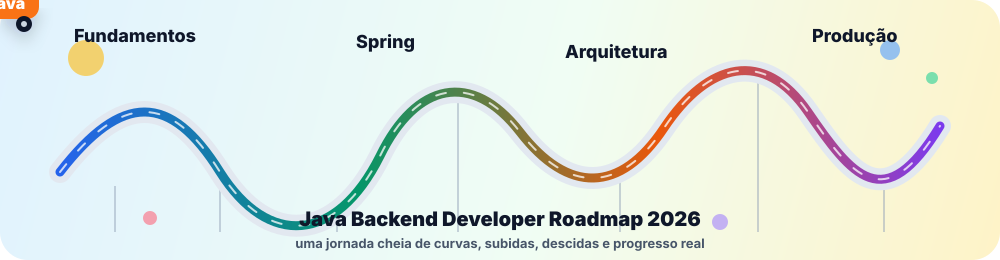

# Java Backend Developer Roadmap 2026

<p align="center">
  
</p>

Aplicação frontend para acompanhar, organizar e medir a evolução nos estudos de **Java Backend Development** em 2026.

O projeto transforma um roadmap de estudos em um painel interativo com categorias, tópicos, subtópicos, progresso, favoritos, anotações e backup local do progresso para versionar no GitHub.

## Objetivo

Este app foi criado para apoiar uma trilha prática de evolução como desenvolvedor backend Java, cobrindo desde fundamentos da linguagem até Spring Boot, banco de dados, arquitetura, testes, segurança, DevOps, produção e carreira.

A ideia não é ser apenas uma lista estática. O painel funciona como um diário visual de estudos: você marca o que já concluiu, acompanha o que está em andamento, registra anotações e mantém um histórico versionável do seu progresso.

## Stack

- Vue 3
- Vite
- TypeScript
- Tailwind CSS
- Lucide Icons
- Node.js local server para servir a build e salvar backup
- Docker e Docker Compose
- Persistência com `localStorage` e arquivo JSON local

## Funcionalidades

- Dashboard com percentual geral de progresso.
- Contadores de tópicos concluídos, em andamento e não iniciados.
- Cards de progresso por categoria.
- Roadmap dividido por trilhas de estudo.
- Cores e ícones por categoria.
- Busca por nome, descrição e subtópicos.
- Filtros por categoria, status e nível.
- Filtro para favoritos.
- Filtro para mostrar apenas pendentes.
- Cards de tópicos com status visual.
- Checklist individual para cada subtópico.
- Modal de detalhes do tópico.
- Campo de anotações pessoais por tópico.
- Favoritos por tópico.
- Exportação de progresso em JSON.
- Importação de progresso em JSON.
- Reset de progresso com confirmação.
- Modo claro e escuro.
- Layout responsivo.
- Persistência após recarregar a página.
- Backup em arquivo para versionar no GitHub.

## Categorias Do Roadmap

- Fundamentos Java
- Orientação a Objetos e Modelagem
- Banco de Dados
- Spring Boot
- Backend Profissional
- Testes
- Arquitetura
- Segurança
- DevOps e Produção
- Carreira e Mentalidade

## Como Rodar Em Desenvolvimento

Instale as dependências:

```bash
npm install
```

Suba o servidor de desenvolvimento:

```bash
npm run dev
```

Depois abra a URL exibida pelo Vite.

## Como Rodar Com Docker

Suba o container:

```bash
docker compose up -d --build
```

Acesse:

```text
http://localhost:2026
```

Para parar:

```bash
docker compose down
```

## Persistência Dos Dados

O app salva o progresso em dois lugares:

1. `localStorage` do navegador.
2. Arquivo local `data/progress.json`, quando executado via Docker ou pelo servidor Node.

O `localStorage` é prático para uso diário, mas depende do navegador. Se você desinstalar o navegador, limpar os dados do site ou trocar de máquina, esse progresso pode sumir.

Por isso o projeto também salva o progresso em:

```text
data/progress.json
```

Esse arquivo fica fora do container por causa do volume configurado no `docker-compose.yml`:

```yaml
volumes:
  - ./data:/data
```

Assim, mesmo que o container seja parado, removido ou recriado, o arquivo de progresso continua no projeto.

## Backup No GitHub

Para manter seu progresso seguro no GitHub, use este fluxo depois de estudar:

```bash
git add data/progress.json
git commit -m "Atualiza progresso do roadmap"
git push
```

Se você trocar de navegador ou máquina, basta clonar o repositório, subir o Docker novamente e acessar:

```text
http://localhost:2026
```

O app tentará carregar o progresso salvo em `data/progress.json`.

## Scripts Disponíveis

```bash
npm run dev
```

Inicia o servidor de desenvolvimento com Vite.

```bash
npm run build
```

Valida TypeScript/Vue e gera a build de produção na pasta `dist`.

```bash
npm run preview
```

Pré-visualiza a build gerada pelo Vite.

## Estrutura Do Projeto

```text
.
├── data/
│   └── progress.json
├── src/
│   ├── components/
│   ├── data/
│   ├── services/
│   ├── types/
│   ├── utils/
│   ├── App.vue
│   ├── index.css
│   └── main.ts
├── Dockerfile
├── docker-compose.yml
├── package.json
├── server.mjs
└── README.md
```

## Principais Arquivos

- `src/data/roadmap.ts`: dados completos do roadmap.
- `src/services/roadmapStorage.ts`: persistência no navegador.
- `src/services/progressBackup.ts`: integração com a API local de backup.
- `server.mjs`: servidor Node que serve a build e grava `data/progress.json`.
- `docker-compose.yml`: configuração do container e volume de dados.

## Rotina Recomendada

1. Abrir o Docker Desktop.
2. Subir o projeto:

```bash
docker compose up -d
```

3. Acessar `http://localhost:2026`.
4. Estudar e marcar progresso.
5. De tempos em tempos, salvar no GitHub:

```bash
git add data/progress.json
git commit -m "Atualiza progresso do roadmap"
git push
```

## Observações Importantes

- Use sempre a mesma URL, `http://localhost:2026`, para manter o mesmo armazenamento do navegador.
- O container não guarda o progresso internamente; ele grava no volume `./data`.
- Não suba `node_modules` ou `dist` para o GitHub.
- O arquivo `data/progress.json` pode ser versionado como backup pessoal do progresso.
- Se ainda não existir `data/progress.json`, ele será criado quando o app salvar o progresso pela primeira vez.

## Status

Projeto funcional para uso local, com frontend interativo, Docker e estratégia de backup versionável no GitHub.
